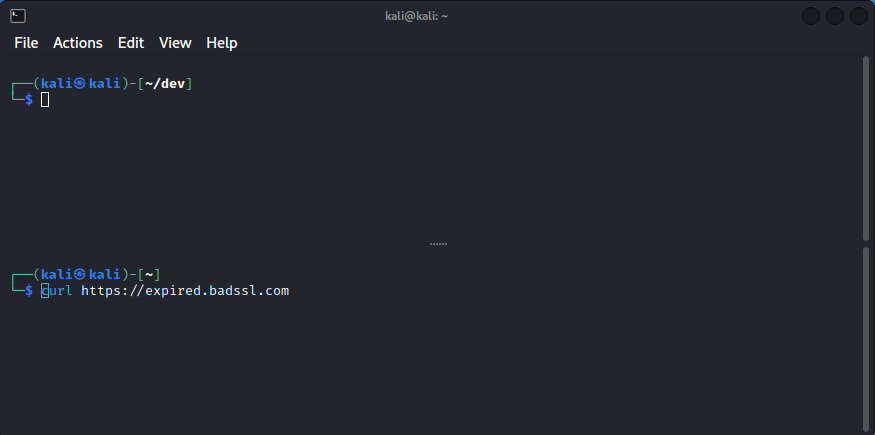

# blindssl -- Disable SSL certificate verification using eBPF

:warning: Works for all binaries that was linked with libssl dynamically (very few) :warning:



## How to launch?

`blindssl` is built as a static binary without any dependencies, and available on the [release](https://github.com/citronneur/blindssl/releases/) page.

```
Usage: blindssl [OPTION...]
blindssl

Uses eBPF to hijack libssl peer certificate verification

USAGE: ./blinssl -p $(/usr/sbin/ldconfig -p | grep libssl.so | cut -d ' ' -f4)
-d /var/log/trace.0

  -d, --daemon               Start blindssl in daemon mode
  -p, --path=PATH            Path to the libssl.so file
  -v, --verbose              Verbose mode
  -?, --help                 Give this help list
      --usage                Give a short usage message
  -V, --version              Print program version

Mandatory or optional arguments to long options are also mandatory or optional
for any corresponding short options.

Report bugs to .

```

As `blindssl` rely on libssl, we have to set the path where libssl is installed on your distribution. To find where libssl is installed you can run the following command :

```
> /usr/sbin/ldconfig -p | grep libssl.so | cut -d ' ' -f4
/lib/x86_64-linux-gnu/libssl.so.1.1
```

Once you get the path you can launch `blindssl` :

```
> ./blindssl -p /lib/x86_64-linux-gnu/libssl.so.1.1
```

An easy way to launch `blindssl` is to use the following command :

```
> ./blindssl -p $(/usr/sbin/ldconfig -p | grep libssl.so | cut -d ' ' -f4)
```

`blindssl` can also be started as a daemon by providing an output file where credentials will be written:

```
./blindssl -p $(/usr/sbin/ldconfig -p | grep libssl.so | cut -d ' ' -f4) -d
```

## How to build?

To build the static binary, we need third-party program. For eBPF we need `clang` to compile the C code into eBPF CO-RE code.
We also rely on `bpftool` to create a skeleton from ebpf program to include it in our userland program. Then we need also `libelf` to find the correct symbol in libpam.

```
sudo apt install make clang-11 gcc libelf-dev bpftool
```

Then just build!

```
git clone https://github.com/citronneur/blindssl --recursive
cd blindssl/src
make
```

## How does It works?

`blindssl` will load userland probes eBPF program to hook
* `SSL_new` function from `libssl.so` to force the verify mode to `SSL_VERIFY_NONE`
* `SSL_get_verify_result` function that will overite the error code to set it to zero (everything is fine!)

This is a PoC with almost very few binaries as target, and just to show the power of eBPF !!!